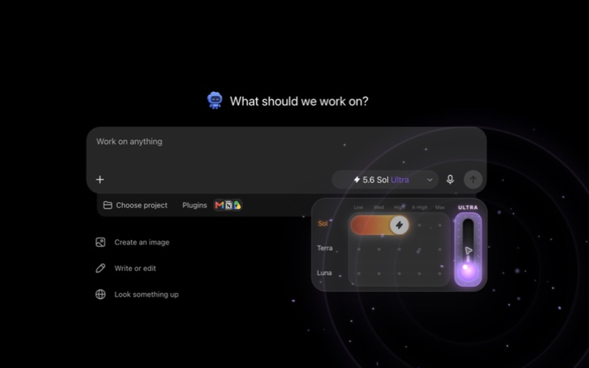
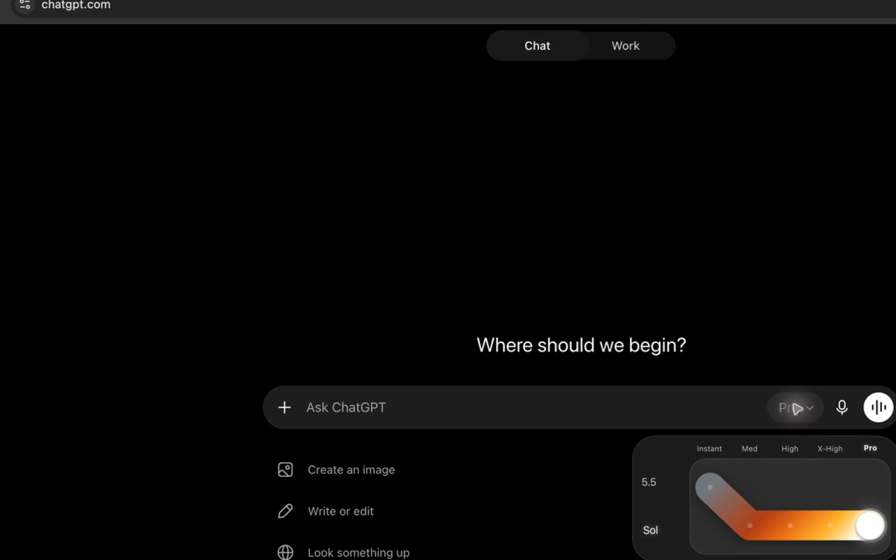

# Modelcade

A playful, magnetic model-and-reasoning picker for ChatGPT. Modelcade opens from ChatGPT's unchanged native composer selector and delegates every choice to ChatGPT's own controls behind the scenes.

  

[Watch the 49-second Modelcade demo with interaction audio →](assets/demo/modelcade-demo.mp4)

Modelcade is an independent project and is not affiliated with or endorsed by OpenAI. ChatGPT is a trademark of OpenAI.

## What is wired

### Layout modes

- **Compact** is enabled by default. Chat becomes one capability-aware rail; Work becomes one capability-aware effort rail with a model wheel.
- **Full** preserves the original 5.5-to-Sol Chat route and free Work field, while removing rows, stops, and the Ultra lever whenever ChatGPT does not actually offer them.
- **Personalization → Modelcade → Compact picker** switches both surfaces together without changing the selected native model, effort, Ultra state, or Fast setting.
- Both layouts open below the composer, stay aligned to its right edge, and inherit its exact corner radius.

### Work

- Models: Sol, Terra, Luna
- Base effort: Low, Med, High, X-High, Max (`Low`, `Med`, and `X-High` map to ChatGPT's native `Light`, `Medium`, and `Extra High`)
- Ultra: a separate override lever, rendered only when ChatGPT's real **General → Enable Ultra effort** switch is on and native Sol confirms that both High and Ultra are enabled for the active account/workspace. Engaging it stages Sol, High, then Ultra in that order, explicitly preserves Fast/Standard, and remembers the prior model. Turning it off returns that model at High.
- Ultra motion: a single continuous stem connects the hidden center axis to the hand knob. Tap toggles; swipe down selects on; swipe up selects off. The control only renders its two settled positions.
- Ultra celebration: after ChatGPT confirms Ultra, the control fires a full-screen particle burst, shockwaves, flash, liquid squash-and-shake sequence, and a synthesized slot-machine jackpot.
- Sound: ordinary model/effort choices produce restrained magnetic clicks; Ultra starts with a low mechanical lever pull. ChatGPT's **Personalization → Modelcade** section includes default-on **Sounds** and **Ultra sound effects** controls plus an independent, default-off **Slot-machine jackpot** choice. Disabling the master immediately silences scheduled audio. Disabling only Ultra sounds gives the lever the ordinary effort click and suppresses its special audio. The optional slot variant compresses a continuous high reel-spin whine, three reel stops, and a jackpot coin burst into less than a second. All sound is synthesized locally with Web Audio—there are no audio downloads or network requests.
- Speed: in both compact and full Work, clicking the already-selected white puck toggles ChatGPT's native Standard/Fast setting. The puck shows ChatGPT's own lightning glyph while Fast is active; a real drag never toggles it. The result is confirmed against the native composer before it is persisted.
- Native composer control: ChatGPT's original model/effort button is preserved exactly, including ChatGPT's own Fast-mode indication. The extension adds nothing to this button.
- Full interaction: drag the shared white control anywhere on the 3 × 5 field. It magnetically steps between exact intersections as soon as the pointer crosses a midpoint, so it never floats between valid choices.
- Compact interaction: scroll, swipe, click, or use Up/Down on the sensitive centered model wheel; drag, click, or use Left/Right on the single Low-to-Ultra rail. The wheel always settles with the selected model in its center. Enter or Space on the selected rail control also toggles Fast.
- Compact rails are a single visible material: the transparent interaction field adds no second shell, outline, or shadow around the fixed lane bed.
- Compact Ultra remains an override rather than a sixth base effort. Entering it forces Sol at High and locks the model wheel. Pulling the lever off restores the remembered model at High; choosing a visible base stop exits Ultra directly at that selected effort.
- The Work gradient ends in a round cap exactly matching the puck's outer diameter and centered underneath it, so the trail and control remain one fused piece at every stop.
- Color: Sol, Terra, and Luna use researched dark-to-light object palettes. Terra keeps roughly 71% of its full spectrum in ocean blues before moving through land and cloud/ice tones.
- The active effort label and puck halo use the color sampled from that point in the selected model gradient. Effort labels keep a restrained single bloom; model names retain their stronger glow for hierarchy.
- Model and effort movement uses restrained directional deformation: horizontal changes stretch slightly along travel, while vertical changes gain a little viscous length without pumping the corners. The motion adapts the low-elasticity directional principle from the MIT-licensed `liquid-glass-react` project; see `THIRD_PARTY_NOTICES.md`.
- The panel entrance animation is one-shot. Ultra's celebration cannot restart it, and a native React control replacement preserves the already-open panel.
- The panel has no footer or close button; click outside it or press Escape to close

### Chat

- Magnetic levels: Instant, Med, High, X-High, Pro
- Compact Chat removes model names and presents those levels on one horizontal rail. Instant begins in graphite black, Medium lands on the darkest Sol ember, and the fill brightens continuously through sun-white Pro.
- The compact control is only a presentation simplification: its accessible value still identifies `5.5` at Instant and `Sol` from Medium through Pro.
- Instant is shown on a distinct `5.5` model row because ChatGPT's native option is `Instant 5.5`
- The draggable route is one continuous fixed rounded lane from 5.5 Instant through the diagonal model transition and across Sol Medium–Pro. A perfectly coincident gradient fill develops only as far as the selected stop while the remainder stays dark, so the lane keeps one silhouette, one shadow, and no overlapping segment seams.
- The colored stroke ends in a round cap exactly matching the puck's outer diameter. Both are driven by one normalized path-distance value, so they remain concentric while following the diagonal, filling the corner, and continuing along the horizontal rail—even on direct Instant-to-Pro jumps.
- The lane geometry never scales or bounces; only the fused puck/cap assembly moves along it.
- Med through Pro sit on an independent `Sol` model track. It starts at Sol's Medium color, skips the unavailable Low tier, and ends at a brighter sun-white Pro stop.
- The white control snaps immediately to valid stops and supports dragging or Left/Right arrow keys
- Active model and effort labels share the exact sampled color for the selected stop
- Chat exposes no native Standard/Fast option, so the picker contains no Fast control in Chat
- There is no title, subtitle, explanatory copy, footer, or close button in the Chat panel

### Native fallback

- **Personalization → Modelcade → Use Modelcade picker** disables the custom picker immediately and restores ChatGPT's native Chat and Work selector behavior without uninstalling the extension.
- **Personalization → Modelcade → Compact picker** switches between compact and full Modelcade layouts. The preference is shared across open ChatGPT tabs and persisted locally.
- The switch is enabled by default and remains available while Modelcade is disabled, so the custom picker can be restored after ChatGPT compatibility updates.
- **Control-Shift-M** opens or closes Modelcade on macOS for both Chat and Work. The listener installs at document start and suppresses ChatGPT's native shortcut only while Modelcade is enabled; disabling Modelcade restores the native shortcut too.
- Every open re-reads ChatGPT's native enabled options. Pro can expose the full set; Plus-style subsets render only their enabled stops; restricted, free, and logged-out surfaces fall back to ChatGPT whenever fewer than two useful choices exist. No plan name is used as an entitlement shortcut.
- Ultra's setting mirror is scoped to a local hash of the visible account and workspace identity. An unknown account starts conservatively with Ultra hidden until ChatGPT's real General switch is observed; an explicit off state remains authoritative even if a stale native trigger still says Ultra.

OpenAI's current availability table is documented in [GPT-5.6 in ChatGPT](https://help.openai.com/en/articles/20001354-gpt-56-in-chatgpt); free-tier behavior is described in the [ChatGPT Free Tier FAQ](https://help.openai.com/en/articles/9275245).

## Palette basis

- Terra allocates 71% of its full trail to ocean blues, matching NASA's estimate that the global ocean covers about 71% of Earth, then moves through vegetation/land and a bright cloud-and-ice finish.
- Luna follows NASA's description of a mostly dark-gray volcanic surface: basalt and subtle titanium-blue/warm mineral variation transition into brighter highland stone.
- Sol moves from deep amber through orange and gold into near-white, reflecting the Sun's broad visible-light output while keeping the familiar warm visual identity.

Sources: [NASA Earth facts](https://science.nasa.gov/earth/facts/), [NASA Moonlight](https://science.nasa.gov/moon/moonlight/), [NASA Color of the Moon](https://science.nasa.gov/photojournal/color-of-the-moon/), and [NASA Visible Light](https://science.nasa.gov/ems/09_visiblelight/).

## Privacy and scope

- Runs only on `https://chatgpt.com/*`
- Uses no OpenAI API key and makes no network requests
- Does not read cookies or conversation text
- Stores only whether Modelcade, compact mode, general sounds, Ultra sounds, and the slot-jackpot variant are enabled; the last Fast/Standard choice; Ultra base/return selection; and a boolean Ultra-setting mirror under a locally derived, obfuscated account/workspace scope key
- Does not store the visible account name, profile-image URL, raw account identifier, workspace name, or plan label

Read the complete [privacy policy](PRIVACY.md).

## Install in Chrome

Until the reviewed Chrome Web Store listing is live, install the signed release source locally:

1. Open `chrome://extensions`.
2. Enable **Developer mode**.
3. Choose **Load unpacked**.
4. Select this `chatgpt-reasoning-picker-extension` folder.
5. Reload ChatGPT.

The release ZIP contains only the Manifest V3 runtime files. Marketing media, QA captures, drafts, and source recordings are not included in the extension package.

## Maintenance note

This is a local DOM bridge to ChatGPT's official selector. It deliberately avoids brittle React internals, but if ChatGPT renames or restructures those menus, the text-based bridge may need a small selector update. Capability discovery is repeated on every open, uses only enabled native choices, and verifies all delegated changes. If there are not enough supported choices—or a transaction cannot be confirmed—it immediately leaves the custom surface and hands control back to ChatGPT's native picker.

Native menus are made transparent during delegated updates and closed immediately afterward, so only the custom slider remains visible.

During each delegated update, the extension freezes a computed visual snapshot over ChatGPT's composer trigger while keeping the live control hidden-but-operational underneath, moves only the temporary native menu off-canvas, and cancels motion only on the controlled trigger/menu/poppers until the official control has settled. The custom picker and unrelated ChatGPT motion are excluded. The very short capability transaction captures user input so a surface switch cannot interrupt its verified rollback.

This stays within Chrome's supported extension boundary: content scripts run in an isolated JavaScript world but share the page DOM and can apply extension CSS. See Chrome's [content-script documentation](https://developer.chrome.com/docs/extensions/develop/concepts/content-scripts) and [scripting/CSS injection reference](https://developer.chrome.com/docs/extensions/reference/api/scripting).
